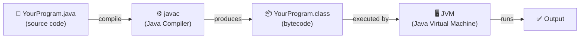

# Java Fundamentals Part 1

## Table of Contents

- [Introduction to Java](#introduction-to-java)
- [First Look at Java code](#1-first-look-at-java-code)
- [Naming Conventions](#2-naming-conventions)
- [Maven & Project Structure](#3-maven--project-structure)
- [Variables & Data Types](#4-variables--data-types)
- [Type Casting](#5-type-casting)
- [Operators](#6-operators)
- [Selection Statements](#7-selection-statements)
- [Strings](#8-strings)
- [Methods](#9-methods)
- [Loops](#10-loops)
- [Classes & Objects](#11-classes--objects)

---

## Introduction to Java

### What is Java?

Java is a **[high-level](https://en.wikipedia.org/wiki/High-level_programming_language), [object-oriented](https://en.wikipedia.org/wiki/Object-oriented_programming), [strongly-typed](https://en.wikipedia.org/wiki/Strong_and_weak_typing), [platform-independent](https://en.wikipedia.org/wiki/Write_once,_run_anywhere)** programming language created by
**[James Gosling](https://en.wikipedia.org/wiki/James_Gosling)** at [Sun Microsystems](https://en.wikipedia.org/wiki/Sun_Microsystems) in **1995** and now maintained by [Oracle](https://en.wikipedia.org/wiki/Oracle_Corporation).

It is one of the most widely used languages in the world, powering enterprise back-end systems, Android apps,
web services, and large-scale distributed platforms.

---

### Key Characteristics

| Characteristic           | What It Means                                                                   |
|--------------------------|---------------------------------------------------------------------------------|
| ✅ Platform Independent   | Compiled code runs on any OS that has a JVM — no recompilation needed           |
| ✅ Object-Oriented        | Everything is organized around classes and objects                              |
| ✅ Strongly Typed         | Every variable must have a declared type; the compiler enforces type rules      |
| ✅ Automatic Memory Mgmt  | The **Garbage Collector** frees unused memory for you — no manual `free()`      |
| ✅ Compiled + Interpreted | Source is compiled to bytecode, then the JVM interprets/JIT-compiles at runtime |

---

### How Java Code Works — The Pipeline

When you write and run a Java program, it goes through the following stages:

```text
  YourProgram.java
       │
       │  javac (Java Compiler)
       ▼
  YourProgram.class  ← bytecode (platform-neutral)
       │
       │  JVM (Java Virtual Machine)
       ▼
    Output on your machine
```



| Stage           | Tool / File        | What Happens                                     |
|-----------------|--------------------|--------------------------------------------------|
| 1. Write Source | `YourProgram.java` | You write human-readable Java code               |
| 2. Compile      | `javac` → `.class` | Compiler translates source into **bytecode**     |
| 3. Execute      | `java` (JVM)       | JVM reads bytecode and runs it on the current OS |

> **Key insight:** Bytecode is *not* machine code. It is a neutral intermediate format that every JVM can understand,
> regardless of the underlying operating system.

---

### JDK vs. JRE vs. JVM

- **JDK (Java Development Kit):** The complete toolkit used to **develop, compile, and run** Java applications.
- **JRE (Java Runtime Environment):** The environment needed to **run** Java applications but not create or compile them.
- **JVM (Java Virtual Machine):** The engine that **executes Java bytecode**, allowing Java programs to run on different operating systems.

### Relationship

JDK = JRE + Development Tools  
JRE = JVM + Libraries  
JVM = Executes Java Bytecode

```text
┌─────────────────────────────────────────────┐
│                   JDK                        │
│  (compiler + debugger + developer tools)     │
│  ┌───────────────────────────────────────┐   │
│  │                JRE                    │   │
│  │  (standard libraries + config files)  │   │
│  │  ┌─────────────────────────────────┐  │   │
│  │  │             JVM                 │  │   │
│  │  │  (executes bytecode at runtime) │  │   │
│  │  └─────────────────────────────────┘  │   │
│  └───────────────────────────────────────┘   │
└─────────────────────────────────────────────┘
```

> As a developer, you always install the **JDK**. It includes everything you need to write, compile, and run Java.

---


## 1) First Look at Java code

In Java, every line of code must be inside a **class**. Depending on the Java version you use, the structure can look
slightly different.

### Standard Java

This is the traditional way to write Java, used in most professional environments.

```java
package se.lexicon; // 1. Package declaration

public class HelloWorld { // 2. Class definition

    public static void main(String[] args) { // 3. The Main method
        System.out.println("Hello, Java!"); // 4. An executable statement
    }
}
```

### Modern Java (JDK 25+)

Starting with newer versions, Java introduced **Implicitly Declared Classes** and **Instance Main Methods** to make it
easier to get started.

```java
package se.lexicon; // 1. Package declaration

public class HelloWorld { // 2. Class definition

    void main() { // 3. Simplified Main method
        IO.println("Hello, Java!"); // 4. Simple Console Output
    }
}
```

### Breakdown of the code:

1. **`package se.lexicon;`**
    - Defines the **namespace** for your code.
    - Helps organize classes and avoid naming conflicts.
    - Usually matches the folder structure.

2. **`public class HelloWorld`**
    - `public`: Means the class is accessible to others.
    - `class`: The keyword used to define a class.
    - `HelloWorld`: The **name** of the class.
    - **Important:** The filename must match the class name exactly (e.g., `HelloWorld.java`).

   > **What is a class?** Think of a class as a **container** — it is the file that holds your code.
   > In Java, all code must live inside a class. For now, just treat it as a required wrapper around your program.
   > You will learn the full power of classes (blueprints, objects, OOP) in **Section 11**.

3. **`public static void main(String[] args)`** (Standard)
    - This is the **Entry Point** of any Java application.
    - `public static void`: Required keywords in older Java versions.
    - `String[] args`: Allows the program to receive information from the command line.

   > **What is a method?** `main` is a **method** — a named block of code that performs a task.
   > When you run a Java program, the JVM looks for `main` and executes the code inside it first.
   > For now, treat it as the "start here" marker. You will learn how to write your own methods in **Section 9**.

4. **`void main()`** (JDK 25+)
    - A simplified way to start a program without needing `public static` or arguments.

5. **`System.out.println` vs `IO.println`**
    - `System.out.println`: The traditional way to print to the console.
    - `IO.println`: A newer, simpler way available in modern Java (JDK 24+).
    - Every statement in Java must end with a **semicolon** (`;`).

---

## 2) Naming Conventions

Following consistent naming conventions makes your code readable and professional. Java uses **Camel Case** for most
identifiers.

### Rules and Guidelines:

- **Classes**: Use **UpperCamelCase** (e.g., `HelloWorld`, `Person`, `MyFirstApp`).
- **Variables & Methods**: Use **lowerCamelCase** (e.g., `firstName`, `seatNumber`, `getInformation()`).
- **Packages**: Use **lowercase** letters, separated by dots (e.g., `se.lexicon.part1`).
- **Constants**: Use **UPPER_SNAKE_CASE** (e.g., `MAX_SPEED`, `PI`).

### Valid vs. Invalid Variable Names:

| Name         | Status         | Why?                                           |
|:-------------|:---------------|:-----------------------------------------------|
| `seatNumber` | ✅ Correct      | Follows lowerCamelCase.                        |
| `SeatNumber` | ❌ Incorrect    | Starts with uppercase (reserved for classes).  |
| `1variable`  | ❌ Invalid      | Cannot start with a number.                    |
| `_temp`      | ⚠️ Discouraged | Allowed, but not recommended in standard Java. |
| `class`      | ❌ Invalid      | Cannot use Java's reserved keywords.           |

---

## 3) Maven & Project Structure

**Maven** is a powerful project management and comprehension tool. 
It helps automate the build process, manage dependencies (libraries), and enforce a standard project structure.

### Why Maven?

- **Dependency Management**: Easily add libraries (like JUnit or MySQL drivers) via the `pom.xml`.
- **Standardized Structure**: Every developer knows where to find the source code and resources.
- **Build Automation**: One command to compile, test, and package your app.

**`groupId`** The **organisation or domain** that owns the project and follows a reverse-domain convention.  
**`artifactId`** The **name of this specific project** (the JAR/module).  

### Standard Maven Directory Layout:

```text
my-app/
├── pom.xml                   # The Project Object Model (configuration file)
├── src/
│   ├── main/
│   │   ├── java/             # Your Java source code (.java files)
│   │   └── resources/        # Config files, images, etc.
│   └── test/
│       ├── java/             # Your test code (JUnit)
│       └── resources/        # Test-specific resources
└── target/                   # Where compiled files are generated (ignored by Git)
```

### The `pom.xml` file:

The `pom.xml` is the heart of a Maven project. It contains information about the project and configuration details used
by Maven to build the project.

#### Group ID, Artifact ID, and Version

Every Maven project is uniquely identified by three coordinates:

| Field          | What It Is                                              | Example                  |
|----------------|---------------------------------------------------------|--------------------------|
| `groupId`      | The **organisation or domain** that owns the project    | `se.lexicon`             |
| `artifactId`   | The **name of this specific project** (the JAR/module)  | `my-app`                 |
| `version`      | The **current version** of the project                  | `1.0-SNAPSHOT`           |

**`groupId`** follows the reverse-domain convention (same as Java package names):
- A company at `lexicon.se` would use `se.lexicon`
- Google would use `com.google`
- An open-source project might use `org.apache`

**`artifactId`** is the unique name for this particular project within that group. If Lexicon had multiple projects,
each one gets its own `artifactId` — for example `student-management`, `course-catalog`, `my-app`.

**`version`** tracks which release this is:
- `1.0-SNAPSHOT` means it is still **in development** (SNAPSHOT = not yet released, may change)
- `1.0.0` would mean a **stable release**

Together, `groupId:artifactId:version` (called **GAV coordinates**) uniquely identify your project across the entire
Maven ecosystem — no two published libraries share the same three values.

```xml
<project>
    <modelVersion>4.0.0</modelVersion>

    <groupId>se.lexicon</groupId>       <!-- who owns it  -->
    <artifactId>my-app</artifactId>     <!-- what it is   -->
    <version>1.0-SNAPSHOT</version>     <!-- which version -->
</project>
```

### Sharing to GitHub (IntelliJ IDEA):

1. **Open the Project**: Ensure your Maven project is open in IntelliJ.
2. **Go to Vcs Menu**: In the top menu, select **Git** (or **VCS**) → **Share Project on GitHub**.
3. **Login**: If not logged in, IntelliJ will prompt you to log in to your GitHub account.
4. **Repository Details**:
    - **Repository Name**: Enter the name for your repository.
    - **Remote**: Usually `origin`.
    - **Description**: (Optional) Add a brief description.
5. **Share**: Click **Share**.
6. **Initial Commit**: A dialog will appear asking which files to include. Make sure all project files (except the
   `target/` folder) are selected, enter a commit message like "Initial commit", and click **Add**.

---

## 4) Variables & Data Types

### What is a variable?

A **variable** is a container for storing data values during the execution of a program. Think of it as a labeled box in
the computer's memory. You give the box a name, tell the computer what kind of data it will hold, and store a value in
it.

### Why do we use variables?

- **Store information**: Keep track of data like user input, calculation results, or application state.
- **Reuse data**: Instead of writing the same value multiple times, you use the variable name.
- **Readability**: Using descriptive names (like `userAge` instead of just `25`) makes the code easier to understand.
- **Manage Change**: If a value needs to be updated (e.g., `taxRate`), you only change it in one place (the variable's
  initialization).

### Java is a Strongly-Typed Language

In Java, every variable must have a **declared type**. This means:

1. **Strict Rules**: You must tell Java what kind of data a variable will hold (e.g., `int`, `double`, `String`) before
   you use it.
2. **Type Safety**: Java checks that you are storing the correct type of data in a variable. For example, you cannot
   accidentally store a word (String) inside a number (int) box.
3. **Memory Efficiency**: By knowing the type, Java knows exactly how much memory to reserve for each variable.

### Primitive Data Types:

| Type      | Size   | Stores                                 | Default  |
|:----------|:-------|:---------------------------------------|:---------|
| `byte`    | 8-bit  | Whole numbers (-128 to 127)            | 0        |
| `short`   | 16-bit | Whole numbers (-32,768 to 32,767)      | 0        |
| `int`     | 32-bit | **Default** for whole numbers          | 0        |
| `long`    | 64-bit | Large whole numbers (suffix `L`)       | 0L       |
| `float`   | 32-bit | Decimals (suffix `f`)                  | 0.0f     |
| `double`  | 64-bit | **Default** for decimals               | 0.0d     |
| `boolean` | 1-bit  | `true` or `false`                      | `false`  |
| `char`    | 16-bit | Single character/Unicode (e.g., `'A'`) | `\u0000` |

### Variable Declaration & Assignment:

```java
// Scenario: an e-commerce order is placed on a webshop

public class OrderSummary {
    void main() {

        // --- Primitives ---
        int     orderId          = 100432;      // int     — unique order number
        int     quantity         = 2;           // int     — number of items purchased
        double  unitPrice        = 899.99;      // double  — price of one item in SEK
        double  discountPercent  = 10.0;        // double  — 10% loyalty discount
        boolean isPaid           = false;       // boolean — payment not yet confirmed
        char    deliveryMethod   = 'E';         // char    — E = Express, S = Standard

        // --- Reference type ---
        String customerName = "Lena Karlsson"; // String  — not a primitive, it is a class (reference type)

        // --- Calculate totals ---
        double subtotal    = quantity * unitPrice;
        double discount    = subtotal * (discountPercent / 100);
        double totalAmount = subtotal - discount;

        // --- Print the order confirmation ---
        IO.println("======= Order Confirmation =======");
        IO.println("Order ID      : " + orderId);
        IO.println("Customer      : " + customerName);
        IO.println("Items ordered : " + quantity + " x " + unitPrice + " SEK");
        IO.println("Subtotal      : " + subtotal + " SEK");
        IO.println("Discount (10%): " + discount + " SEK");
        IO.println("Total         : " + totalAmount + " SEK");
        IO.println("Delivery      : " + (deliveryMethod == 'E' ? "Express" : "Standard"));
        IO.println("Paid          : " + isPaid);

        // --- Update: payment is confirmed ---
        isPaid = true;
        IO.println("\nPayment status updated: " + isPaid);
    }
}
```

1. **For Whole Numbers**: Use **`int`** as your default choice. It's suitable for most everyday tasks.
2. **For Very Large Numbers**: If you think the value might exceed 2 billion (e.g., world population, large financial
   transactions), use **`long`**.
3. **For Decimals**: Use **`double`** as the standard for decimals. It's more precise than `float`.
4. **For Absolute Accuracy** (e.g., money/banking): In more advanced Java, we use a class called `BigDecimal` because
   `double` can sometimes have tiny rounding errors in calculations. For now, stick to `double` for learning!

---

## 5) Type Casting

Type casting is when you assign a value of one primitive data type to another type.

- **Widening Casting (automatically)**: `byte` → `short` → `char` → `int` → `long` → `float` → `double`
- **Narrowing Casting (manually)**: `double` → `float` → `long` → `int` → `char` → `short` → `byte`

```java
public class TypeCastingDemo {
    void main() {
        // 1. Widening Casting (Automatic)
        // Converting a smaller type to a larger type size:
        // byte -> short -> char -> int -> long -> float -> double
        int myInt = 9;
        double myDouble = myInt; // Automatic casting: int to double

        IO.println("-- Widening Casting --");
        IO.println("Int value: " + myInt);       // 9
        IO.println("Double value: " + myDouble); // 9.0

        // 2. Narrowing Casting (Manual)
        // Converting a larger type to a smaller size type:
        // double -> float -> long -> int -> char -> short -> byte
        double d = 9.78;
        int i = (int) d; // Manual casting: double to int

        IO.println("\n-- Narrowing Casting --");
        IO.println("Double value: " + d); // 9.78
        IO.println("Int value: " + i);    // 9 (decimal part is lost)

        // 3. Potential for Data Loss (Overflow)
        int largeInt = 130;
        byte smallByte = (byte) largeInt;

        IO.println("\n-- Data Loss (Overflow) --");
        IO.println("Large Int: " + largeInt);   // 130
        IO.println("Small Byte: " + smallByte); // -126 (Wait, what happened? Overflow!)
    }
}
```

> ⚠️ **What does "Data Loss" mean?**
>
> 1. **Truncation**: When converting from `double` to `int`, the decimal part (the `.78`) is simply chopped off. It does
     **not** round to the nearest whole number; it always rounds down toward zero.
> 2. **Overflow**: If you cast a very large number into a smaller type (like `long` to `int`), the value will "wrap
     around" if it's bigger than what the smaller type can hold, leading to a completely different (and incorrect)
     number.

---

## 6) Operators

**Operators** are special symbols used to perform operations on variables and values. They are the "verbs" of your
programming language—telling Java what to do with your data.

### Arithmetic Operators:

Used to perform common mathematical operations.

| Operator | Name           | Description                        | Example (a=10, b=3) | Result |
|:---------|:---------------|:-----------------------------------|:--------------------|:-------|
| `+`      | Addition       | Adds two values                    | `a + b`             | `13`   |
| `-`      | Subtraction    | Subtracts one value from another   | `a - b`             | `7`    |
| `*`      | Multiplication | Multiplies two values              | `a * b`             | `30`   |
| `/`      | Division       | Divides one value by another       | `a / b`             | `3`    |
| `%`      | Modulus        | Returns the division **remainder** | `a % b`             | `1`    |

### Assignment Operators:

Used to assign values to variables and perform shortcut operations.

| Operator | Name                  | Example  | Equivalent to |
|:---------|:----------------------|:---------|:--------------|
| `=`      | Assignment            | `x = 5`  | `x = 5`       |
| `+=`     | Addition assignment   | `x += 3` | `x = x + 3`   |
| `-=`     | Subtraction assign.   | `x -= 2` | `x = x - 2`   |
| `*=`     | Multiplication assign | `x *= 4` | `x = x * 4`   |
| `/=`     | Division assignment   | `x /= 2` | `x = x / 2`   |

### Comparison Operators:

Used to compare two values. They always return a **boolean** (`true` or `false`).

| Operator | Name                  | Example  | Result (x=10, y=5) |
|:---------|:----------------------|:---------|:-------------------|
| `==`     | Equal to              | `x == y` | `false`            |
| `!=`     | Not equal to          | `x != y` | `true`             |
| `>`      | Greater than          | `x > y`  | `true`             |
| `<`      | Less than             | `x < y`  | `false`            |
| `>=`     | Greater than or equal | `x >= y` | `true`             |
| `<=`     | Less than or equal    | `x <= y` | `false`            |

### Logical Operators:

Used to combine multiple conditions together.

| Operator  | Name        | Description                                      | Example                |
|:----------|:------------|:-------------------------------------------------|:-----------------------|
| `&&`      | Logical AND | Returns `true` if **both** conditions are true.  | `x > 5 && x < 20`     |
| `\|\|`    | Logical OR  | Returns `true` if **at least one** is true.      | `x == 10 \|\| x == 20` |
| `!`       | Logical NOT | Reverses the result (`true` → `false`).          | `!(x == 10)`           |

```java
public class OperatorDemo {
    void main() {
        // Arithmetic Operators
        int a = 10;
        int b = 3;
        IO.println("-- Arithmetic --");
        IO.println("a + b = " + (a + b));  // 13
        IO.println("a - b = " + (a - b));  // 7
        IO.println("a * b = " + (a * b));  // 30
        IO.println("a / b = " + (a / b));  // 3
        IO.println("a % b = " + (a % b));  // 1

        // Assignment Operators
        int x = 10;
        IO.println("\n-- Assignment --");
        IO.println("start x = " + x); // 10
        x += 5; // 15
        x -= 2; // 13
        x *= 2; // 26
        x /= 2; // 13
        IO.println("final x = " + x); // 13

        // Comparison Operators
        int p = 10;
        int q = 5;
        IO.println("\n-- Comparison --");
        IO.println("p == q -> " + (p == q)); // false
        IO.println("p != q -> " + (p != q)); // true
        IO.println("p > q  -> " + (p > q));  // true
        IO.println("p <= q -> " + (p <= q)); // false

        // Logical Operators
        int n = 10;
        boolean andResult = (n > 5 && n < 20);   // true
        boolean orResult = (n < 5 || n == 10);  // true
        boolean notResult = !(n == 10);          // false
        IO.println("\n-- Logical --");
        IO.println("n > 5 && n < 20 -> " + andResult);
        IO.println("n < 5 || n == 10 -> " + orResult);
        IO.println("!(n == 10) -> " + notResult);
    }
}
```

---

## 7) Selection Statements

**Selection Statements** allow your program to make decisions and choose different paths of execution based on specific
conditions. They are the "brains" of your application—telling Java when to perform certain actions.

### 1. If / Else If / Else

Used when you have one or more conditions to check.

| Statement | Purpose                                                             |
|:----------|:--------------------------------------------------------------------|
| `if`      | Runs a block of code if the condition is **true**.                  |
| `else if` | Checks a new condition if the first one was **false**.              |
| `else`    | Runs a block of code if **none** of the above conditions were true. |

### 2. Switch Statement

Best used when checking a **single variable** against multiple fixed values (like a menu or days of the week).

#### Modern Arrow Syntax (`->`):

Available in modern Java (Java 14+). It is cleaner because it **automatically breaks** after each case, preventing "
fall-through" errors.

#### Traditional Syntax (with `break`):

You might see this in older code. You **must** use the `break` keyword, or Java will keep running the code in the next
case!

```java
public class SelectionDemo {
    void main() {
        // Example 1: If-Else (Temperature Check)
        int temperature = 25;
        IO.println("-- Temperature Check --");
        if (temperature > 30) {
            IO.println("It's hot outside!");
        } else if (temperature >= 15) {
            IO.println("The weather is nice.");
        } else {
            IO.println("It's cold outside.");
        }

        // Example 2: Switch (Traffic Light)
        String lightColor = "Green";
        IO.println("\n-- Traffic Light --");
        switch (lightColor) {
            case "Red" -> IO.println("Stop!");
            case "Yellow" -> IO.println("Prepare to stop.");
            case "Green" -> IO.println("Go!");
            default -> IO.println("Invalid light color.");
        }

        // Example 3: If-Else If-Else (Membership Level)
        int points = 150;
        IO.println("\n-- Membership Level --");
        if (points >= 200) {
            IO.println("Status: Gold Member");
        } else if (points >= 100) {
            IO.println("Status: Silver Member");
        } else {
            IO.println("Status: Bronze Member");
        }

        // Example 4: Switch (Day Type)
        String day = "Saturday";
        IO.println("\n-- Day Type --");
        switch (day) {
            case "Monday", "Tuesday", "Wednesday", "Thursday", "Friday" -> IO.println("It's a weekday.");
            case "Saturday", "Sunday" -> IO.println("It's the weekend!");
            default -> IO.println("Invalid day.");
        }
    }
}
```

---

## 8) Strings

A **String** in Java is an **object** that represents a sequence of characters. Unlike `int` or `double`, which are
primitive types, `String` is a **Reference Type**.

### Key Characteristics:

1. **Immutable**: Once a `String` is created, its value **cannot be changed**. When you modify a string (e.g., adding
   more text), Java actually creates a brand-new string object in memory.
2. **String Pool**: To save memory, Java stores only one copy of each literal string in a special area called the
   "String Pool."

### Common String Methods:

Java provides many built-in methods to manipulate and inspect strings.

| Method                   | Description                       | Example (`s = "Hello"`) | Result    |
|:-------------------------|:----------------------------------|:------------------------|:----------|
| `.length()`              | Returns the number of characters. | `s.length()`            | `5`       |
| `.toUpperCase()`         | Converts to uppercase.            | `s.toUpperCase()`       | `"HELLO"` |
| `.toLowerCase()`         | Converts to lowercase.            | `s.toLowerCase()`       | `"hello"` |
| `.contains("...")`       | Checks if it contains text.       | `s.contains("ell")`     | `true`    |
| `.replace(old, new)`     | Replaces characters.              | `s.replace('l', 'p')`   | `"Heppo"` |
| `.isEmpty()`             | Checks if length is 0.            | `s.isEmpty()`           | `false`   |
| `.substring(start, end)` | Extracts a part of the string.    | `s.substring(0, 2)`     | `"He"`    |

### Escape Characters:

Sometimes you need to include special characters in a string, like a **new line**, a **tab**, or **double quotes**. In
Java, we use the backslash (`\`) as an **escape character**.

| Escape Sequence | Description      | Example Code                     |
|:----------------|:-----------------|:---------------------------------|
| `\n`            | New Line         | `IO.println("Line 1\nLine 2");`  |
| `\t`            | Tab (Indent)     | `IO.println("Name:\tErik");`     |
| `\"`            | Double Quote     | `IO.println("He said \"Hi!\"");` |
| `\\`            | Backslash itself | `IO.println("Path: C:\\temp");`  |

### String Comparison

In Java, you should **never** use `==` to compare the content of two strings.

- **`==`**: Checks if the two variables point to the same **memory location**.
- **`.equals()`**: Checks if the two strings have the **same characters**.

```java
public class StringDemo {
    void main() {

        String s1 = "Java";
        String s2 = new String("Java");
        IO.println(s1 == s2);      // false (different locations in memory)
        IO.println(s1.equals(s2)); // true (same content)


        String message = "  Welcome to Java Programming!  ";

        IO.println("-- String Inspection --");
        IO.println("Original: [" + message + "]");
        IO.println("Length: " + message.length());
        IO.println("Contains 'Java': " + message.contains("Java"));

        IO.println("\n-- String Manipulation --");
        IO.println("Uppercase: " + message.toUpperCase());
        IO.println("Trimmed: [" + message.trim() + "]"); // Removes leading/trailing spaces
        IO.println("Replace Java with Lexicon: " + message.replace("Java", "Lexicon"));

        IO.println("\n-- Comparison --");
        String name1 = "Erik";
        String name2 = "erik";
        IO.println("Erik equals erik? " + name1.equals(name2)); // false
        IO.println("Erik equalsIgnoreCase erik? " + name1.equalsIgnoreCase(name2)); // true

        IO.println("\n-- Escape Characters --");
        IO.println("Hello\nWorld");          // New line
        IO.println("Tab\tSpace");           // Tab
        IO.println("Quotes: \"Hello\"");     // Double quotes
        IO.println("Backslash: \\");        // Single backslash
    }
}
```

---

## 9) Methods

**Methods** are blocks of code that perform a specific task. They allow you to write logic once and reuse it many times
across your program. This follows the **DRY** principle: **Don't Repeat Yourself**.

### Why use Methods?

- **Reusability**: Write once, use everywhere.
- **Organization**: Break down a large program into smaller, manageable "sub-tasks."
- **Readability**: Using descriptive names (like `calculateTax()`) makes the code easier to follow.
- **Maintainability**: If you need to change a calculation, you only change it in one place.

### Anatomy of a Method:

A method usually has four main parts:

1. **Return Type**: The type of data the method gives back (e.g., `int`, `String`). Use **`void`** if it returns
   nothing.
2. **Method Name**: A descriptive name in `lowerCamelCase`.
3. **Parameters (Inputs)**: Variables inside parentheses that receive information needed for the task.
4. **Method Body**: The code between `{ }` that does the work.

```java
// AccessModifier Static (optional) ReturnType Name(Parameters)
public static int add(int num1, int num2) {
    return num1 + num2; // Gives back the result
}
```

### Parameters vs. Arguments

- **Parameters**: The variables defined in the method signature (the "placeholders").
- **Arguments**: The actual values you pass into the method when you call it.

```java
public class MethodDemo {

   // 1. Method with no return (void) and no parameters
   public static void sayHello() {
      IO.println("Hello from the Calculator!");
   }

   // 2. Method with parameters
   public static void printSum(int a, int b) {
      IO.println("The sum is: " + (a + b));
   }

   // 3. Method with a Return Type
   public static int multiply(int x, int y) {
      return x * y; // Sends the result back to the caller
   }
   
    void main() {
        // Calling static methods directly using the Class name
       MethodDemo.sayHello();

        // Calling a static method with arguments
       MethodDemo.printSum(10, 5); // 10 and 5 are arguments

        // Calling a static method and storing the return value
        int result = MethodDemo.multiply(4, 3);
        IO.println("The multiplication result is: " + result);
    }
}
```

---

### Access Modifiers

**Access Modifiers** are keywords used to set the **visibility** and **accessibility** of classes, fields, and methods.
They control which parts of your program can "see" or "use" certain code.

### Why use Access Modifiers?

- **Encapsulation**: Hide sensitive data from the outside world.
- **Security**: Prevent unauthorized parts of the program from modifying critical variables.
- **API Design**: Only show what is necessary for others to use, while hiding the internal logic.

| Modifier    | Description                                                                 |
|:------------|:----------------------------------------------------------------------------|
| `public`    | The code is accessible to **all classes** in the project.                   |
| `private`   | The code is accessible **only within the same class**.                      |
| `default`   | (No keyword) The code is accessible only within the **same package**.       |
| `protected` | Accessible within the **same package** and by **subclasses** (Inheritance). |

### Comparison Table:

| Modifier    | Class | Package | Subclass | World |
|:------------|:-----:|:-------:|:--------:|:-----:|
| `public`    |   ✅   |    ✅    |    ✅     |   ✅   |
| `protected` |   ✅   |    ✅    |    ✅     |   ❌   |
| `default`   |   ✅   |    ✅    |    ❌     |   ❌   |
| `private`   |   ✅   |    ❌    |    ❌     |   ❌   |

---

## 10) Loops

**Loops** are used to execute a block of code multiple times as long as a specified condition is met. They are
essential for handling repetitive tasks without writing the same code over and over.

### 1. The `for` Loop
Best used when you know exactly **how many times** you want to loop through a block of code.

### 2. The `while` Loop
Best used when you want the loop to continue until a **specific condition** becomes false. You don't always know
exactly how many iterations it will take.

### 3. The `do-while` Loop
Similar to the `while` loop, but it will always execute the code block **at least once** before checking the
condition.

### Loop Control: `break` and `continue`

- **`break`**: Used to **exit** the loop immediately.
- **`continue`**: Used to **skip** the current iteration and move to the next one.

---

```java
public class LoopDemo {
    void main() {
        // Example 1: For loop (Counting)
        IO.println("-- For Loop --");
        for (int i = 0; i < 3; i++) {
            IO.println("Iteration: " + i);
        }

        // Example 2: While loop (Conditional)
        IO.println("\n-- While Loop --");
        int coffeeCups = 0;
        while (coffeeCups < 3) {
            coffeeCups++;
            IO.println("Drinking cup #" + coffeeCups);
        }

        // Example 3: Break & Continue
        IO.println("\n-- Break & Continue --");
        for (int j = 1; j <= 5; j++) {
            if (j == 2) continue; // Skip number 2
            if (j == 4) break;    // Stop completely at 4
            IO.println("Value: " + j);
        }
    }
}
```

---

## 11) Classes & Objects

Imagine you need to store information about **3 people**. Using only variables, you would write this:

```java
void main() {
    // Person 1
    String firstName1 = "Erik";
    String lastName1  = "Svensson";
    int    age1       = 25;

    // Person 2
    String firstName2 = "Sofia";
    String lastName2  = "Karlsson";
    int    age2       = 30;

    // Person 3
    String firstName3 = "Lena";
    String lastName3  = "Andersson";
    int    age3       = 22;

    IO.println(firstName1 + " " + lastName1 + ", age: " + age1);
    IO.println(firstName2 + " " + lastName2 + ", age: " + age2);
    IO.println(firstName3 + " " + lastName3 + ", age: " + age3);
}
```

This already looks messy with just 3 people. Now imagine **100 people** — you would need 300 variables, all named
manually, with no structure connecting them. Problems with this approach:

- ❌ **Hard to read** — `firstName1`, `firstName2`, `firstName3`... the naming never ends
- ❌ **Hard to scale** — adding a 4th person means adding 3 more separate variables
- ❌ **Easy to make mistakes** — nothing stops you from accidentally mixing up `age2` with `age3`
- ❌ **No grouping** — there is no way to say "these 3 variables belong to the same person"

> **This is exactly the problem that classes solve.** A class lets you group related data together and
> create as many "persons" as you need from a single definition.

---

### Class vs. Object

To understand OOP, you need to know the difference between a **Class** and an **Object**:

1. **Class (The Blueprint)**: A template that defines what an object will look like and what it can do. It doesn't
   exist in memory as a "thing"—it's just a plan.
2. **Object (The Instance)**: A specific "thing" created from the blueprint. It exists in memory and has its own
   specific data.

**Analogy:**

- A **Class** is like an **architect's drawing** of a house.
- An **Object** is the **actual house** built on a specific street. You can build many houses (objects) from one
  drawing (class).

### Anatomy of a Class: Fields & Methods

A class typically contains two main things:

1. **Fields (State/Data)**: Variables that store information about the object — this is where `firstName`, `lastName`,
   and `age` will live.
2. **Methods (Behavior/Actions)**: Functions that define what the object can do (e.g., `introduce()`).

Now let's solve the earlier problem properly using a class:

```java
// 1. Define the Blueprint (Class)
class Person {
    // Fields (State) — replaces firstName1/firstName2/firstName3...
    String firstName;
    String lastName;
    int    age;

    // Method (Behavior)
    void introduce() {
        IO.println("Hi, I am " + firstName + " " + lastName + ", age " + age);
    }
}

// 2. Use the Blueprint to create Objects
public class PersonDemo {
    void main() {
        // Create person 1 — no more firstName1, lastName1, age1
        Person p1 = new Person();
        p1.firstName = "Erik";
        p1.lastName  = "Svensson";
        p1.age       = 25;

        // Create person 2
        Person p2 = new Person();
        p2.firstName = "Sofia";
        p2.lastName  = "Karlsson";
        p2.age       = 30;

        // Create person 3
        Person p3 = new Person();
        p3.firstName = "Lena";
        p3.lastName  = "Andersson";
        p3.age       = 22;

        // Call the method on each object
        p1.introduce();
        p2.introduce();
        p3.introduce();
    }
}
```

Compare this to the messy version above — same 3 people, but now:

- ✅ Each person is a **single object** instead of 3 loose variables
- ✅ Adding a 4th person is just 4 lines, not 3 more separate variable declarations
- ✅ The `introduce()` method is written **once** and works for every person

### Key Points:

- The **`new`** keyword is used to create a new object (instantiation).
- Use the **dot operator (`.`)** to access an object's fields or call its methods.
- Each object has its **own copy** of the fields. Changing `p1.age` does not affect `p2.age`.

---
