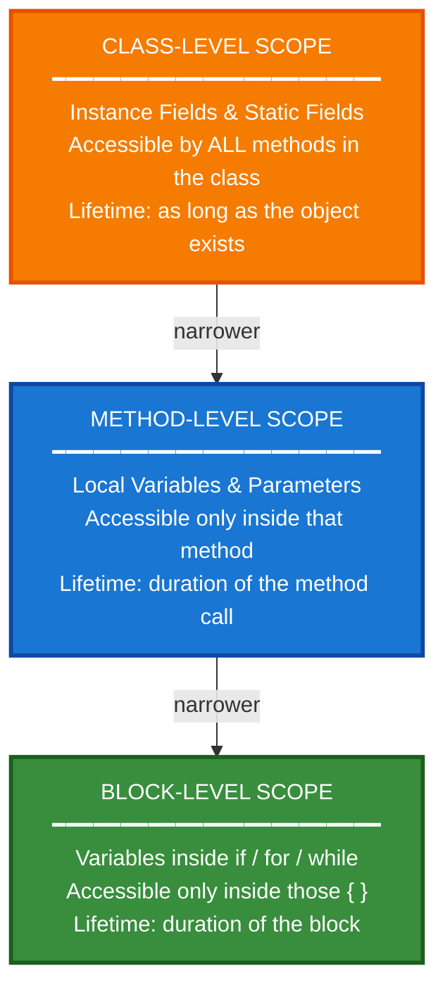
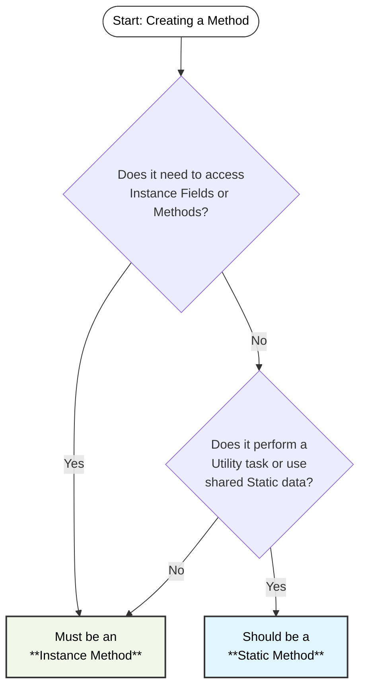
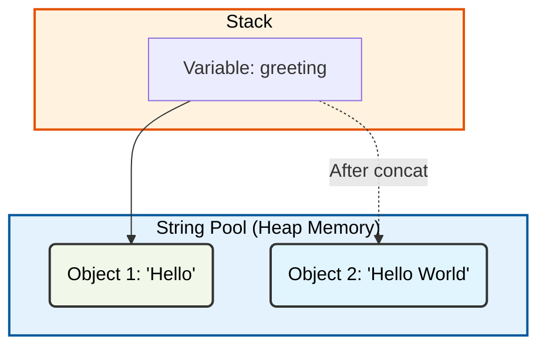

# Java Fundamentals Part 2

## Table of Contents

- [1) Variable Scope](#1-variable-scope)
- [2) final Keyword](#2-final-keyword)
- [3) Static vs Instance](#3-static-vs-instance)
- [4) Method Overloading](#4-method-overloading)
- [5) Strings](#5-strings)
- [6) StringBuilder](#6-stringbuilder)
- [7) Math Class](#7-math-class)
- [8) Date & Time API](#8-date--time-api)

## 1) Variable Scope

**Scope** defines two things about a variable:

- **Visibility**: which parts of the code can read or modify it.
- **Lifetime**: when the variable is created in memory and when it is destroyed.

In Java, where you **declare** a variable determines both its scope and its lifetime.

### Scope Levels Overview

Java has three levels of scope, each nested inside the other:



### 1. Class-Level Scope (Fields)

Variables declared inside a class but outside any method. They are accessible from **any method** within the class and
live as long as the object (or class, for static fields) exists in memory.

- **Instance Variables**: Belong to a specific object. Each object gets its own copy.
- **Static Variables**: Belong to the class itself. Shared by all objects.

### 2. Method-Level Scope (Local Variables & Parameters)

Variables declared inside a method, **and method parameters**, are only accessible within that specific method. They are
created when the method is called and **destroyed** when the method finishes execution.

> **Parameters** are part of method-level scope. They behave exactly like local variables — they only exist for the
> duration of the method call.

### 3. Block-Level Scope

Variables declared inside a block (`if`, `for`, `while`) are only accessible within those curly braces `{}`. They are
created when the block is entered and destroyed when the block exits.

### Summary Table

| Scope         | Where Declared                    | Accessible From              | Lifetime                      |
|:--------------|:----------------------------------|:-----------------------------|:------------------------------|
| Class-Level   | Inside class, outside any method  | All methods in the class     | As long as the object exists  |
| Method-Level  | Inside a method or as a parameter | Only that method             | Duration of the method call   |
| Block-Level   | Inside `{}` of if/for/while       | Only inside that block       | Duration of the block         |

### Example

```java
public class ShoppingCart {
    
    // 1. Class-Level Scope (Instance Field)
    //    Accessible from any method in this class
    double totalPrice;

    void addItem(String itemName, double price) {
        // 2. Method-Level Scope (Parameter & Local Variable)
        //    'itemName', 'price', and 'discount' only exist inside this method
        double discount = price * 0.1;
        double finalPrice = price - discount;

        if (finalPrice > 0) {
            // 3. Block-Level Scope
            //    'message' only exists inside this if-block
            String message = "Added: " + itemName + " for " + finalPrice;
            IO.println(message); // OK
        }
        // IO.println(message); // ERROR: 'message' is out of scope here

        totalPrice += finalPrice; // OK: 'totalPrice' is class-level, accessible here
    }

    void printTotal() {
        // IO.println(finalPrice); // ERROR: 'finalPrice' belongs to addItem(), not here
        IO.println("Total: " + totalPrice); // OK: class-level field is accessible
    }
}
```

### Variable Shadowing

**Shadowing** happens when a local variable or parameter has the **same name** as a class field. The local variable
"shadows" (hides) the field inside that method.

```java
public class Product {
    String name; // Class-level field

    void setName(String name) {     // Parameter 'name' shadows the field 'name'
        // name = name;             // BUG: assigns the parameter to itself — field is hidden!
        this.name = name;           // Use 'this' to reach through the shadow to the field
    }
}
```

> This is exactly why the `this` keyword exists — to distinguish between a shadowed field and a local variable
> when they share the same name. See **Section 3** for a full explanation.

---

## 2) final Keyword

The `final` keyword means **"this cannot be changed"**. It can be applied to variables, methods, and classes.

### 1. `final` Variables

A `final` variable can only be assigned **once**. Any attempt to reassign it causes a compile error.

```java
public class FinalDemo {
    void main() {
        final int maxAttempts = 3;
        // maxAttempts = 5; // COMPILE ERROR: cannot assign a value to final variable

        IO.println("Max login attempts: " + maxAttempts);
    }
}
```

### 2. `static final` Constants

The most common use of `final` is combined with `static` to create a **class-level constant** — a value shared by all
instances that never changes. By convention, these are written in `UPPER_SNAKE_CASE`.

```java
public class AppConfig {
    static final String APP_NAME    = "Lexicon App";
    static final double TAX_RATE    = 0.25;
    static final int    MAX_RETRIES = 3;
}
```

```java
public class FinalStaticDemo {
    void main() {
        IO.println("App: " + AppConfig.APP_NAME);
        IO.println("Tax: " + AppConfig.TAX_RATE * 100 + "%");
    }
}
```

### 3. Summary Table

| Applied To       | Effect                                                  |
|:-----------------|:--------------------------------------------------------|
| `final` variable | Value cannot be reassigned after the first assignment.  |
| `final` method   | Cannot be overridden in a subclass.                     |
| `final` class    | Cannot be extended (e.g., `String` is a `final` class). |

> **Key Insight:** `String` is a `final` class. This is one reason why it is immutable — no subclass can override its
> behavior and change how it stores characters.

---

## 3) Static vs Instance

Understanding the difference between **Static** and **Instance** members is crucial for managing data and memory in
Java. This distinction determines whether a piece of data belongs to a specific **object** or to the **class itself**.

### 1. Instance Members (Default)

Instance fields and methods belong to a specific **instance (object)** of a class. Every time you create a new object
using `new`, a separate copy of these members is created in memory.

- **Instance Fields**: Represent the **state** of an individual object (e.g., an account holder's name).
- **Instance Methods**: Define **behaviors** that operate on that specific object's data (e.g., depositing money into a
  specific account).

### 2. Static Members

Static fields and methods are declared with the `static` keyword. They belong to the **class itself**, not to any
specific object.

- **Static Fields**: Shared by **all instances** of the class. If one object changes a static field, the change is
  visible to all other objects.
- **Static Methods**: Can be called without creating an object. They usually perform utility tasks that don't depend on
  object-specific data (e.g., `Math.sqrt()`).

### Comparison Table

| Feature        | Instance Members             | Static Members                |
|:---------------|:-----------------------------|:------------------------------|
| **Belongs To** | An **Object** (Instance)     | The **Class** itself          |
| **Storage**    | Heap Memory (per object)     | Method Area (once per class)  |
| **Access**     | Via object name (`obj.name`) | Via class name (`Class.name`) |
| **Usage**      | Unique data for each object  | Shared data/Utility functions |
| **Example**    | `accountBalance`             | `interestRate`                |

### Practical Example: Bank Account

```java
public class BankAccount {
    // 1. Instance Fields (Unique to each account)
    String accountHolder;
    double balance;
  
    // 2. Static Field (Shared by ALL accounts)
    static double interestRate = 4.5;
  
    // 3. Instance Method (Operates on specific account)
    public void deposit(double amount) {
      this.balance += amount;
      IO.println(accountHolder + " deposited " + amount);
    }
  
    // 4. Static Method (Utility: shared logic)
    public static void setInterestRate(double newRate) {
      interestRate = newRate;
      IO.println("Global interest rate updated to: " + interestRate + "%");
    }
  
    public static double calculateLoanRepayment(double amount, int years) {
      // Calculate the total repayment amount for a loan.
      // Formula: Total = Principal + (Principal * Rate * Time)
      return amount + (amount * (interestRate / 100) * years);
    }
}
```

```java
public class BankApp {
    void main() {
        // Working with Instance members
        BankAccount acc1 = new BankAccount();
        acc1.accountHolder = "Anna";
        acc1.deposit(500);

        BankAccount acc2 = new BankAccount();
        acc2.accountHolder = "Björn";
        acc2.deposit(1000);

        // Working with Static members (Call using Class Name)
        BankAccount.setInterestRate(5.0);
        IO.println(BankAccount.calculateLoanRepayment(1000, 5));
                
    }
}
```

### When to Use What?

#### Decision Diagram: Static or Instance?

Use this flowchart to decide whether your method should be **Static** or an **Instance** method.



- **Use Instance** when the data is unique to each object (e.g., ID, Name, Color).
- **Use Static** when the data is common to all objects (e.g., a shared configuration, a counter) or when creating a
  utility method that doesn't need object data.

### 3. The `this` Keyword

The `this` keyword is a reference to the **current instance** of the class. It is only available inside **instance
methods** — you cannot use `this` inside a `static` method because static methods have no object context.

The most common use is to resolve a naming conflict between an **instance field** and a **method parameter** that share
the same name.

```java
public class BankAccount {
    String accountHolder;
    double balance;

    public void setAccountHolder(String accountHolder) {
        // accountHolder = accountHolder; // BUG: assigns the parameter to itself!
        this.accountHolder = accountHolder; // Correct: assigns the parameter to the field
    }

    public void deposit(double amount) {
        this.balance += amount;
        IO.println(this.accountHolder + " deposited: " + amount);
    }
}
```

> **Why can't `static` methods use `this`?**  
> Because `this` refers to a specific object, and static methods belong to the **class** — not to any object.
> There is no "current instance" to refer to.

---

## 4) Method Overloading

Method Overloading is a feature in Java that allows a class to have more than one method with the same name, as long as
their parameter lists are different. It is a way to achieve Compile-Time Polymorphism.

### Key Rules:

- Methods **must** have the same name.
- Methods **must** have different parameters (different type, number, or both).
- Return type **can** be different, but changing the return type alone is not enough to overload a method.

### Why use Overloading?

It improves code readability by allowing descriptive method names without needing prefixes like `addInt`, `addDouble`,
etc.

### Examples:

```java
import java.math.BigDecimal;
import java.math.BigInteger;

public class OverloadingDemo {
  // Add two integers
  public static int add(int a, int b) {
    return a + b;
  }

  // Overloaded: Add two doubles
  public static double add(double a, double b) {
    return a + b;
  }

  // Overloaded: Add multiple integers using Varargs
  // The term **Varargs** is short for "variable-length arguments." It allows a method to accept zero or more arguments of a specified type.
  public static int add(int... numbers) {
    int sum = 0;
    for (int n : numbers) {
      sum += n;
    }
    return sum;
  }

}
```

```java
public class PaymentProcessor {
    // Process Credit Card
    public static void processPayment(String cardNumber, String cvv, double amount) {
        IO.println("Processing Card: " + cardNumber);
    }

    // Process Bank Transfer
    public static void processPayment(String bankAccount, String swift, double amount, String currency) {
        IO.println("Processing Bank Transfer");
        IO.println("Bank Account: " + bankAccount + ", Amount: " + amount + " " + currency);
        
    }
}
```

```java
public class NotificationService {
    // Send a simple notification
    public static void send(String message) {
        IO.println("Sending Notification: " + message);
    }

    // Overloaded: Send a notification to a specific email
    public static void send(String message, String email) {
        IO.println("Sending Email to " + email + ": " + message);
    }

    // Overloaded: Send a notification with a priority level
    public static void send(String message, int priority) {
        IO.println("Priority [" + priority + "] Notification: " + message);
    }
}
```

---

## 5) Strings

The **String** class in Java is used to represent a sequence of characters.   
It is one of the most commonly used classes and is part of the `java.lang` package.

Strings in Java are **immutable**, which means their content **cannot be changed** once they are created in memory.

#### How it works

Any operation that seems to "modify" a string (like `concat()`, `toUpperCase()`, or `replace()`) actually creates a **new** string object in the String Pool, while the original remains unchanged. The variable on the stack is then updated to point to the new object.

> **What happens to the original data?**    
> The original string object remains in the **String Pool**.   
> If it is no longer referenced by any variable, it becomes eligible for **Garbage Collection**, meaning the JVM will eventually remove it from memory to free up space.  
> However, if other variables still point to it, it stays exactly as it was.  
> *For more info, see: [Garbage Collection in Java](https://www.geeksforgeeks.org/garbage-collection-in-java/)*



```java
public class StringDemo {
    void main() {
        String greeting = "Hello";
        greeting.concat(" World"); // This creates a new string but doesn't change 'greeting'
        IO.println(greeting); // Output: Hello (The original object is untouched)

        greeting = greeting.concat(" World"); // Re-assigning the variable to the new object
        IO.println(greeting); // Output: Hello World
    }
}
```

### Common String Methods

| Method                            | Description                                                 |
|:----------------------------------|:------------------------------------------------------------|
| `length()`                        | Returns the number of characters.                           |
| `charAt(index)`                   | Returns the character at the specified index.               |
| `indexOf(...)`                    | Returns the index of a character or substring (Overloaded). |
| `substring(...)`                  | Extracts a portion of the string (Overloaded).              |
| `equals(other)`                   | Compares content for equality (case-sensitive).             |
| `equalsIgnoreCase(other)`         | Compares content for equality (ignoring case).              |
| `toUpperCase()` / `toLowerCase()` | Converts the string's casing.                               |
| `trim()`                          | Removes leading and trailing whitespace.                    |
| `replace(old, new)`               | Replaces occurrences of a character or substring.           |
| `isBlank()`                       | Checks if the string is empty or contains only whitespace.  |
| `"""` (Text Blocks)               | Multi-line string literal (Modern Java).                    |

#### 1. `indexOf()`

The `indexOf()` method is a great example of **Method Overloading** in the Java Standard Library. It allows you to
search for characters or substrings in different ways.

| Signature                            | Description                                     |
|:-------------------------------------|:------------------------------------------------|
| `indexOf(int ch)`                    | Finds first occurrence of a character.          |
| `indexOf(String str)`                | Finds first occurrence of a substring.          |
| `indexOf(int ch, int fromIndex)`     | Finds character starting from a specific index. |
| `indexOf(String str, int fromIndex)` | Finds substring starting from a specific index. |

#### 2. `substring()`

The `substring()` method is also **overloaded**, providing two ways to extract text. Note that Java uses **0-based
indexing**.

| Signature                                 | Description                                                  |
|:------------------------------------------|:-------------------------------------------------------------|
| `substring(int beginIndex)`               | Extracts from `beginIndex` to the very end.                  |
| `substring(int beginIndex, int endIndex)` | Extracts from `beginIndex` up to `endIndex` (**exclusive**). |

```java
public class StringMethodsDemo {
    void main() {
        String message = "Java Programming is Fun!";

        // 1. indexOf() Examples (Overloaded)
        IO.println("-- indexOf() --");
        int firstP = message.indexOf('P');          // 5 (Finds character 'P')
        int firstGram = message.indexOf("gram");    // 8 (Finds substring "gram")
        int secondA = message.indexOf('a', 2);      // 3 (Finds 'a' starting from index 2)
        int missing = message.indexOf("Python");    // -1 (Not found)

        IO.println("First 'P': " + firstP);
        IO.println("First 'gram': " + firstGram);
        IO.println("Second 'a': " + secondA);
        IO.println("Missing: " + missing);

        // 2. substring() Examples (Overloaded)
        IO.println("\n-- substring() --");
        String language = message.substring(0, 4);      // "Java" (0 to 3, 4 is exclusive)
        String topic = message.substring(5, 16);        // "Programming" (5 to 15, 16 is exclusive)
        String remainder = message.substring(17);       // "is Fun!" (17 to the very end)

        IO.println("Language: " + language);
        IO.println("Topic: " + topic);
        IO.println("Remainder: " + remainder);

    }
}
```

#### 3. Text Blocks (`"""`)

Introduced in modern Java (JDK 15+), **Text Blocks** provide a much cleaner way to write multi-line strings. They
automatically handle newlines and indentation, making the code much easier to read.

- Use triple quotes `"""` to start and end the block.
- No need to use `\n` for every new line.
- Great for SQL queries, JSON, or multi-line messages.

```java
public class StringMethodsDemo {
    void main() {
        
        
        // 1. Traditional Multi-line String
        String oldWay = "This is the old way.\n" +
                "It requires concatenation\n" +
                "and manual newline characters.";

        // 2. Modern Text Block
        String newWay = """
                This is a Text Block.
                It preserves the line breaks
                and makes the code look exactly like the output.
                """;

        IO.println(oldWay);
        IO.println("---");
        IO.println(newWay);
    }
}
```

---

## 6) StringBuilder

While `String` objects are immutable, **StringBuilder** represents a **mutable** sequence of characters. It is the
preferred choice when you need to perform many modifications (like appending or inserting) to a string in a loop.

### Key Characteristic: Mutability

Unlike `String`, `StringBuilder` modifies the actual object in memory rather than creating a new one every time. This makes it significantly more efficient for heavy string manipulation.

#### Why use StringBuilder?

- **Performance**: Prevents memory bloat caused by creating thousands of temporary `String` objects during concatenation.
- **In-place Modification**: Allows you to add, remove, or reverse characters directly.

When you call `append()`, `StringBuilder` modifies the existing object in the **Heap Memory**. The variable on the **Stack** continues to point to the same object.

### Common StringBuilder Methods

| Method             | Description                                               |
|:-------------------|:----------------------------------------------------------|
| `append(data)`     | Adds text to the end of the current sequence.             |
| `insert(i, data)`  | Inserts text at the specified index.                      |
| `replace(s, e, d)` | Replaces characters in a range with new text.             |
| `delete(s, e)`     | Removes characters between the specified indices.         |
| `reverse()`        | Reverses the character sequence.                          |
| `length()`         | Returns the current number of characters.                 |
| `toString()`       | Converts the `StringBuilder` back into a normal `String`. |

```java
public class StringBuilderDemo {
    void main() {
        // 1. Creation
        // StringBuilder sb = new StringBuilder();
        StringBuilder sb = new StringBuilder("Hello");

        // 2. Appending
        sb.append(" World");
        sb.append("!");
        IO.println("After append: " + sb); // "Hello World!"

        // 3. Inserting
        sb.insert(6, "Java ");
        IO.println("After insert: " + sb); // "Hello Java World!"

        // 4. Deleting
        sb.delete(11, 17);
        IO.println("After delete: " + sb); // "Hello Java!"

        // 5. Reversing
        sb.reverse();
        IO.println("After reverse: " + sb); // "!avaJ olleH"

        // 6. Converting back to String
        String finalResult = sb.toString();
    }
}
```

---

## 7) Math Class

The **`Math`** class (from `java.lang`) is a collection of **static utility methods** for mathematical operations. You
never create a `Math` object — you call its methods directly using the class name, making it a perfect real-world
example of static methods from Section 3.

### Common Methods

| Method                | Description                                 | Example            | Result       |
|:----------------------|:--------------------------------------------|:-------------------|:-------------|
| `Math.abs(x)`         | Absolute value (removes negative sign)      | `Math.abs(-7)`     | `7`          |
| `Math.max(a, b)`      | Returns the larger of two values            | `Math.max(10, 25)` | `25`         |
| `Math.min(a, b)`      | Returns the smaller of two values           | `Math.min(10, 25)` | `10`         |
| `Math.pow(base, exp)` | Raises a number to the power of another     | `Math.pow(2, 10)`  | `1024.0`     |
| `Math.sqrt(x)`        | Square root                                 | `Math.sqrt(144)`   | `12.0`       |
| `Math.round(x)`       | Rounds to the nearest whole number          | `Math.round(4.6)`  | `5`          |
| `Math.floor(x)`       | Rounds **down** to the nearest whole number | `Math.floor(4.9)`  | `4.0`        |
| `Math.ceil(x)`        | Rounds **up** to the nearest whole number   | `Math.ceil(4.1)`   | `5.0`        |
| `Math.random()`       | Returns a random `double` between 0.0–1.0   | `Math.random()`    | e.g. `0.73`  |
| `Math.PI`             | The constant π (pi)                         | `Math.PI`          | `3.14159...` |

```java
public class MathDemo {
    void main() {
        // 1. Absolute value
        IO.println(Math.abs(-42));       // 42

        // 2. Max and Min
        IO.println(Math.max(100, 250));  // 250
        IO.println(Math.min(100, 250));  // 100

        // 3. Power and Square Root
        IO.println(Math.pow(2, 8));      // 256.0
        IO.println(Math.sqrt(256));      // 16.0

        // 4. Rounding
        IO.println(Math.round(4.4));     // 4
        IO.println(Math.round(4.5));     // 5
        IO.println(Math.floor(4.9));     // 4.0
        IO.println(Math.ceil(4.1));      // 5.0

        // 5. Random number between 1 and 100
        int random = (int) (Math.random() * 100) + 1;
        IO.println("Random (1-100): " + random);

        // 6. Circle area using Math.PI
        double radius = 5.0;
        double area = Math.PI * Math.pow(radius, 2);
        IO.println("Circle area: " + area); // 78.539...
    }
}
```

> **Tip:** `Math.random()` produces a value from `0.0` (inclusive) to `1.0` (exclusive).  
> To get a random integer in a range: `(int)(Math.random() * range) + min`  
> Example — random number between 1 and 6 (dice): `(int)(Math.random() * 6) + 1`

---

## 8) Date & Time API

Java 8 introduced the modern **Date and Time API** (found in the `java.time` package) to replace the older, more confusing `Date` and `Calendar` classes. This modern API is **immutable**, **[thread-safe](https://www.baeldung.com/java-thread-safety)**, and follows the **[ISO-8601](https://en.wikipedia.org/wiki/ISO_8601)** calendar system.

### Core Classes

The API is built around three main classes for representing different aspects of time:

| Class               | Represents                                              | Example               |
|:--------------------|:--------------------------------------------------------|:----------------------|
| **`LocalDate`**     | A date without time or timezone (Year, Month, Day).     | `2024-05-15`          |
| **`LocalTime`**     | A time without date or timezone (Hour, Minute, Second). | `14:30:00`            |
| **`LocalDateTime`** | A combined date and time.                               | `2024-05-15T14:30:00` |

### Key Operations

#### 1. Creation & Parsing

You can create instances using `now()` for the current moment, `of()` for specific values, or `parse()` to convert a
string into a date/time object.

#### 2. Manipulation

Because these classes are **immutable**, methods like `plusDays()`, `minusHours()`, or `withYear()` do not change the
original object; they return a **new** instance with the requested change.

#### 3. Formatting

The **`DateTimeFormatter`** class is used to display dates and times in specific patterns (e.g., `dd/MM/yyyy`).

### Date & Time Example

```java
import java.time.LocalDate;
import java.time.LocalTime;
import java.time.LocalDateTime;
import java.time.format.DateTimeFormatter;

public class DateTimeDemo {
    void main() {
        // 1. Current Date & Time
        LocalDate today = LocalDate.now();
        LocalTime now = LocalTime.now();
        LocalDateTime currentDateTime = LocalDateTime.now();

        IO.println("Today: " + today); // 2024-02-26
        IO.println("Current Time: " + now); // 15:57:45.123

        // 2. Creating Specific Dates (of)
        LocalDate specificDate = LocalDate.of(2023, 12, 25);
        LocalDateTime appointment = LocalDateTime.of(2024, 6, 1, 10, 30);

        // 3. Manipulation (Plus/Minus)
        LocalDate tomorrow = today.plusDays(1);
        LocalDate nextMonth = today.plusMonths(1);
        LocalDate lastYear = today.minusYears(1);

        IO.println("Tomorrow: " + tomorrow);
        IO.println("Next Month: " + nextMonth);

        // 4. Parsing from String
        LocalDate parsedDate = LocalDate.parse("2025-01-01");

        // 5. Custom Formatting
        DateTimeFormatter formatter = DateTimeFormatter.ofPattern("eeee, dd MMMM yyyy HH:mm");
        String formattedTime = currentDateTime.format(formatter);

        IO.println("Formatted Date: " + formattedTime);
        // Example: Monday, 26 February 2024 15:57


    }
}
```

#### Common Format Patterns:

- `yyyy`: 4-digit year (2024)
- `MM`: Month (02) | `MMMM`: Full Month (February)
- `dd`: Day (26)
- `eeee`: Full day name (Monday)
- `HH`: 24-hour format | `hh`: 12-hour format
- `mm`: Minutes | `ss`: Seconds

*For a full list of all available pattern letters, see
the [DateTimeFormatter Javadoc](https://docs.oracle.com/javase/8/docs/api/java/time/format/DateTimeFormatter.html#patterns).*

#### 4. (Optional) Instant

The **`Instant`** class represents a specific point on the timeline in **UTC (Coordinated Universal Time)**. It is
measured as the number of nanoseconds since the "Unix Epoch" (January 1, 1970, 00:00:00 UTC).

> **Why UTC?** UTC is the global time standard with no daylight saving and no offset.
> Every time zone on earth is defined as **UTC+X** or **UTC−X**, so UTC is the neutral "source of truth".
> The rule is simple: **store timestamps in UTC, convert to local time only when displaying to a user.**

- **Use Case**: Best for timestamps, logging, and measuring performance.
- **Precision**: Highly accurate (nanosecond precision).

#### 5. (Optional) Time Zones

By default, `LocalDateTime` does not store time zone information. If you need to handle time across different parts of
the world, use **`ZonedDateTime`** and **`ZoneId`**.

```java
import java.time.Instant;
import java.time.ZonedDateTime;
import java.time.ZoneId;

public class DateTimeDemo {
    void main() {
        // ... (sections 1–5 above)

        // 6. Instant
        // Current timestamp in UTC
        Instant instantNow = Instant.now();
        IO.println("Current Instant: " + instantNow);
        // Example: 2024-02-26T15:57:45.123Z (The 'Z' stands for Zulu/UTC)

        // 7. Time Zones
        // Get time in a specific zone
        ZonedDateTime newYorkTime = ZonedDateTime.now(ZoneId.of("America/New_York"));
        IO.println("New York Time: " + newYorkTime);

        // Get your local system's default zone
        ZoneId myZone = ZoneId.systemDefault();
        IO.println("My Zone: " + myZone);
    }
}
```

---